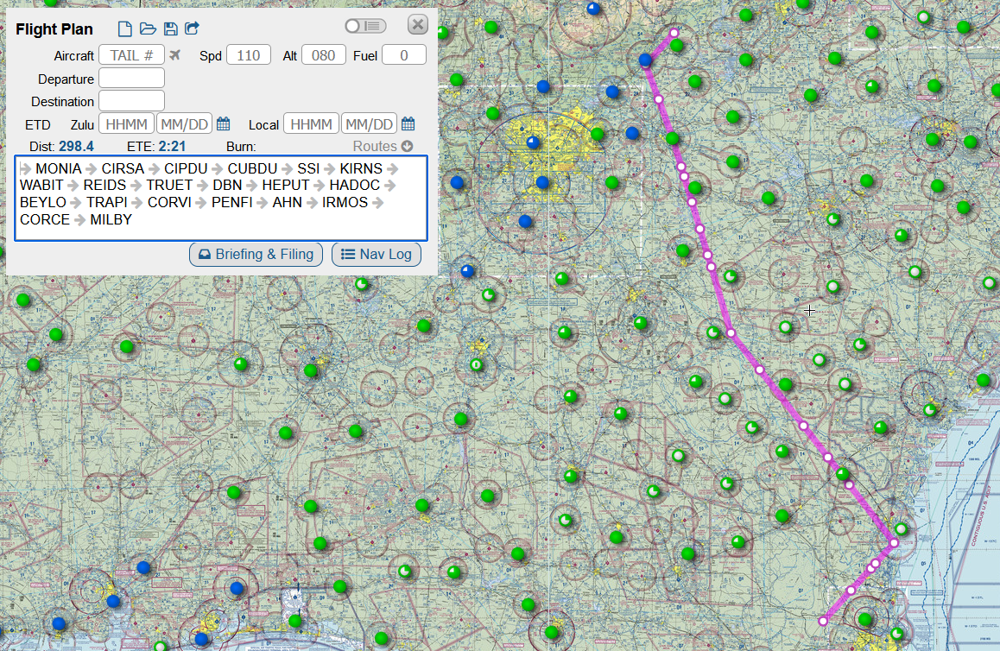
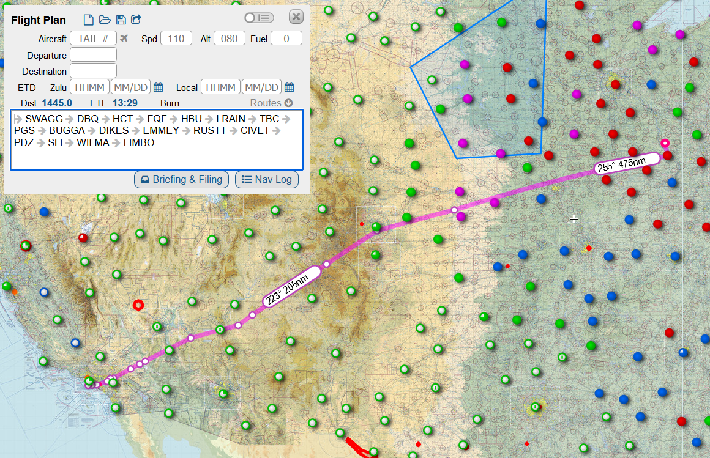

# flight-planner

**This is not a certified software tool**

The goal of this project is to automatically create optimal flight plans, given departure and arrival airports and constraints (such as airspace restrictions, NOTAMs, etc.)

## Project Status
The project currently is a command line based tool that can find the shortest path (disregarding constraints) between two waypoints if they are on defined airways in the USA. 

The following shortcomings are known:
- The tool does not work on connecting airports to airports.
- The tool cannot connect Alaska and Hawaii to the continental USA.
- The tool only works in the USA.

## Installation

Install [poetry](https://python-poetry.org/). Then, just clone the repository and run
```
poetry update
```
to activate the virtual environment and install dependencies. From there, you're good to go!

## Usage 

### Generating an Airway Database
An airway graph is provided in `data/`, but to regenerate it from the local NASR files (also in `data/`) run:
```
poetry run python generate_airways.py
```
This script has the following optional parameters:
 - `--awy_file`: path to the NASR `AWY_SEG.csv`. Default is to the relevant file in the `data/` directory.
 - `--fix_file`: path to the NASR `FIX_BASE.csv`. Default is to the relevant file in the `data/` directory.
 - `--apt_file`: path to the NASR `APT_BASE.csv`. Default is to the relevant file in the `data/` directory.
 - `--navaid_file`: path to the NASR `NAV_BASE.csv`. Default is to the relevant file in the `data/` directory.
 - `--star_file`: path to the NASR `STAR_RTE.csv`. Default is to the relevant file in the `data/` directory.
 - `--sid_file`: path to the NASR `DP_RTE.csv`. Default is to the relevant file in the `data/` directory.
 - `--in_file`: path to a file containing an airway graph to modify. Default is no input.
 - `--out_file`: path to output the generated airway graph to. Default is `data/airway_graph.pkl`.

### Flight Planning
To find a flight plan between two waypoints, run:
```
poetry run python main.py [start] [end]
```
where `start` and `end` are the waypoint identifiers. The script has the following optional parameters:
 - `--graph_file`: path to the airway graph (generated above). Default is `data/airway_graph.pkl`.

## Example

For a flight plan between `MONIA` and `MILBY`, run:
```
poetry run python main.py MONIA MILBY
```
The resulting plan is shown in SkyVector:


A longer flight from `SWAGG` to `LIMBO` can be found with:
```
poetry run python main.py SWAGG LIMBO
```
The resulting plan is shown in SkyVector:


